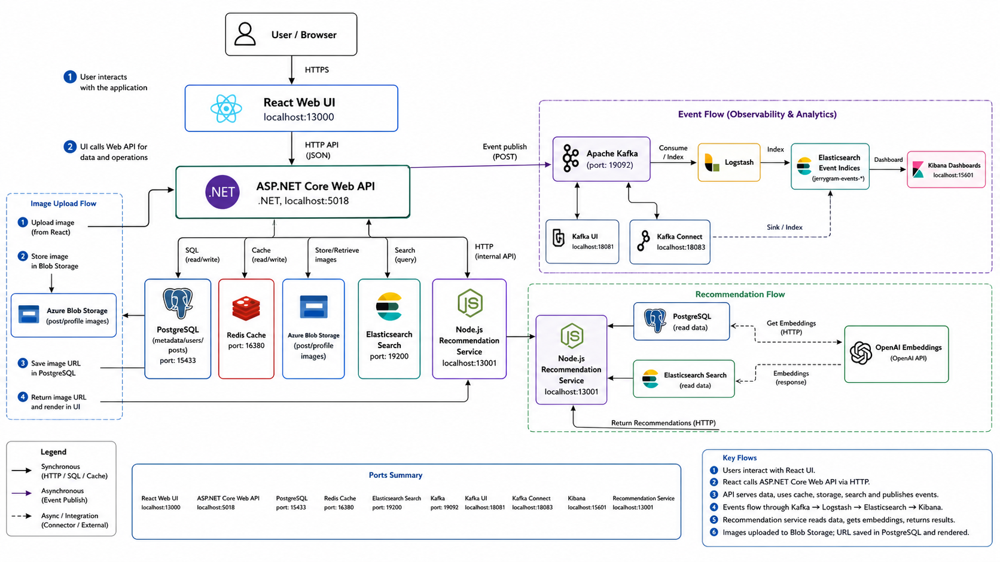
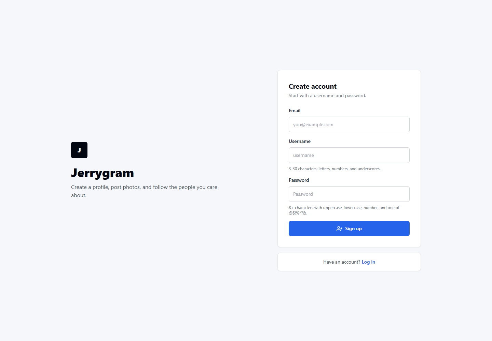
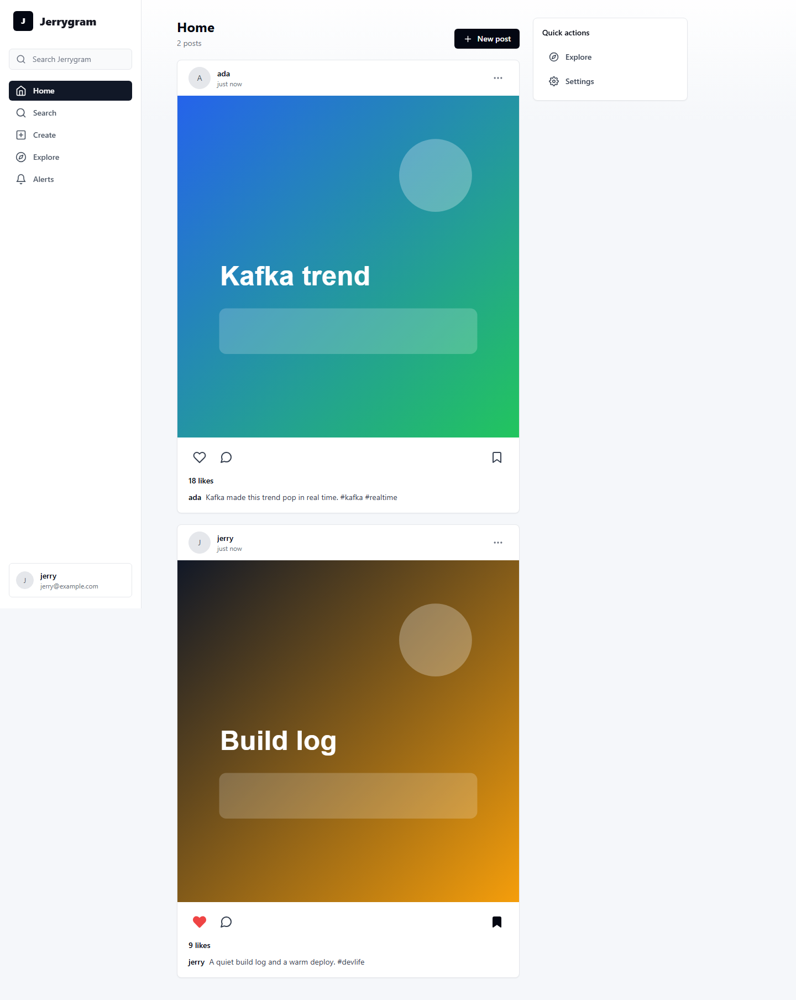
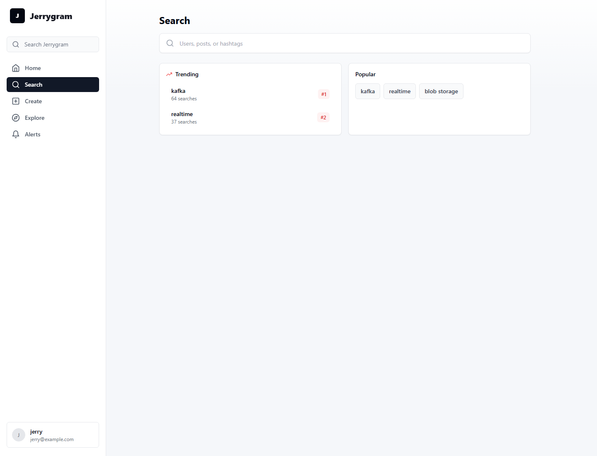

# Jerrygram

언어: [English](README.md) | 한국어 | [日本語](README.ja.md)

[](https://github.com/wonhongChang/jerrygram/actions/workflows/ci.yml)

Jerrygram은 React, ASP.NET Core, PostgreSQL, Redis, Blob Storage, Elasticsearch, Kafka, Logstash, Kibana, Node.js 추천 서비스를 함께 사용하는 Instagram 스타일 소셜 앱입니다.

## 한눈에 보기

| 영역 | Jerrygram에서 보여주는 것 |
| --- | --- |
| 제품 흐름 | 회원가입/로그인, 피드, 게시물 업로드, 프로필, 검색, 알림, 저장한 게시물, 탐색 추천 |
| 백엔드 | layered architecture 기반 ASP.NET Core Web API, EF Core, Redis 캐시, Blob Storage, Elasticsearch, Kafka 이벤트, JWT 인증 |
| 이벤트 analytics | 검색/게시물/사용자 이벤트가 Kafka와 Logstash/Kafka Connect를 거쳐 `jerrygram-events-*` 인덱스로 적재됨 |
| 추천 | Node.js 서비스가 캡션 embedding, Redis 캐시, cosine similarity로 후보 게시물을 정렬 |
| Java 범위 | Java 21 + Spring Boot 백엔드를 대체 구현으로 유지하고 CI에서 검증 |
| 품질 검증 | GitHub Actions build/test, .NET 테스트, Java smoke test, Node 추천 테스트, React unit test, Playwright E2E |

현재 검증한 기본 실행 경로는 다음과 같습니다.

- React 웹 UI: `http://localhost:13000`
- ASP.NET Core Web API: `http://localhost:5018`
- Docker 인프라: PostgreSQL, Redis, Elasticsearch, Kafka, Kafka UI, Logstash, Kibana, Kafka Connect, 추천 서비스

저장소에는 Java/Spring Boot 백엔드도 포함되어 있습니다. 현재 웹 UI는 기본적으로 .NET API에 연결됩니다.

## 아키텍처



백엔드 내부 구조는 [docs/backend-architecture.ko.md](docs/backend-architecture.ko.md)에 정리되어 있습니다.

## 스크린샷







## 문서

- [백엔드 아키텍처](docs/backend-architecture.ko.md)
- [추천과 Kafka 증거](docs/recommendation-and-kafka.ko.md)
- [Elasticsearch 인덱스 목록](docs/elasticsearch-indexes.ko.md)
- [환경 변수와 시크릿 설정](docs/env-and-secrets.ko.md)
- [시드 데이터](infra/seed/README.ko.md)

## 컴포넌트 README

- [.NET 백엔드](backend-dotnet/README.ko.md)
- [Java 백엔드](backend-java/README.ko.md)
- [React 프론트엔드](frontend-react/README.ko.md)
- [추천 서비스](jerrygram-recommend/README.ko.md)

## 기능

- 회원가입, 로그인, 로그아웃, 현재 사용자 로딩을 포함한 JWT 인증
- multipart 업로드 기반 사진 게시물 생성
- 홈 피드, 공개 게시물, 게시물 상세, 탐색, 프로필, 검색 화면
- 좋아요, 댓글, 팔로우, 알림, 프로필 수정, 저장한 게시물
- Redis 캐시와 인메모리 fallback
- Elasticsearch 기반 검색과 탐색
- .NET API의 Kafka 이벤트 발행
- Kafka에서 Logstash/Kafka Connect를 거쳐 Elasticsearch로 적재되는 이벤트 파이프라인
- `jerrygram-events-*`를 확인할 수 있는 Kibana 구성
- 캡션 임베딩과 cosine similarity로 후보 게시물을 정렬하는 Node.js 추천 서비스
- 회원가입, 피드 상호작용, Kafka 기반 검색 트렌드를 검증하는 Playwright E2E 테스트

## 로컬 포트

Jerrygram은 다른 Docker 프로젝트와 충돌하지 않도록 호스트 포트를 조정해 사용합니다.

| 서비스 | URL / 호스트 포트 |
| --- | --- |
| React 웹 UI | `http://localhost:13000` |
| ASP.NET Core API | `http://localhost:5018` |
| 추천 서비스 | `http://localhost:13001` |
| PostgreSQL | `localhost:15433` |
| Redis | `localhost:16380` |
| Elasticsearch | `http://localhost:19200` |
| Kafka | `localhost:19092` |
| Kafka UI | `http://localhost:18081` |
| Kibana | `http://localhost:15601` |
| Logstash API | `http://localhost:19600` |
| Kafka Connect | `http://localhost:18083` |

## 설정

```powershell
Copy-Item .env.example .env
Copy-Item backend-dotnet/WebApi/appsettings.example.json backend-dotnet/WebApi/appsettings.json
Copy-Item frontend-react/.env.example frontend-react/.env
Copy-Item jerrygram-recommend/.env.example jerrygram-recommend/.env
Copy-Item backend-java/.env.example backend-java/.env
```

시크릿 관리 방식은 [docs/env-and-secrets.ko.md](docs/env-and-secrets.ko.md)를 참고하세요.

## Docker 인프라 실행

```powershell
docker compose -f docker-compose.yml -f docker-compose.kafka-elk-extended.yml up -d
```

## .NET API 실행

```powershell
dotnet run --project backend-dotnet/WebApi/WebApi.csproj --urls http://localhost:5018
```

## React 웹 실행

```powershell
cd frontend-react
npm install
npm start
```

## 시드와 증거 확인

```powershell
powershell -ExecutionPolicy Bypass -File .\infra\seed\seed-jerrygram.ps1
powershell -ExecutionPolicy Bypass -File .\infra\seed\verify-jerrygram-demo.ps1
```

## 검증

```powershell
dotnet build backend-dotnet/WebApi/WebApi.csproj --configuration Release
dotnet test backend-dotnet/Domain.Tests/Domain.Tests.csproj --configuration Release
dotnet test backend-dotnet/Infrastructure.Tests/Infrastructure.Tests.csproj --configuration Release
```

```powershell
cd backend-java
.\gradlew.bat test
```

```powershell
cd frontend-react
npm.cmd run test:ci
npm.cmd run e2e
```

```powershell
cd jerrygram-recommend
npm.cmd test
npm.cmd run lint
npm.cmd audit --omit=dev
```
