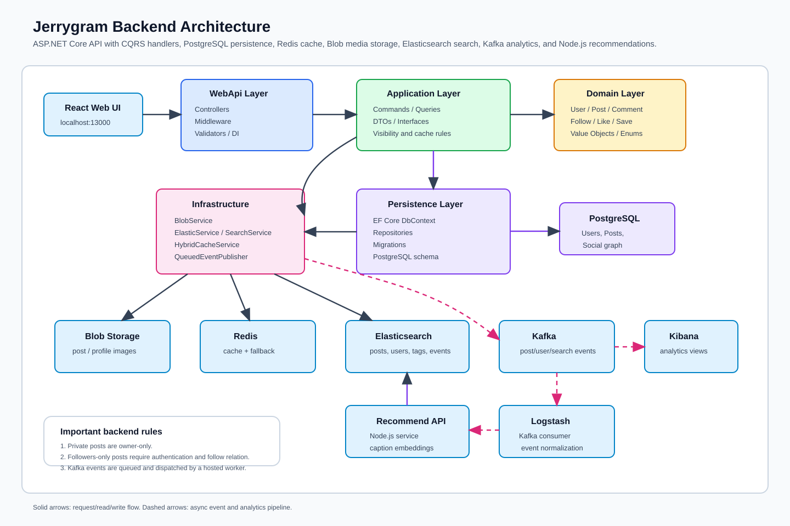

# Jerrygram 백엔드 아키텍처

언어: [English](backend-architecture.md) | 한국어 | [日本語](backend-architecture.ja.md)

이 문서는 현재 웹 UI가 사용하는 `backend-dotnet` 아키텍처를 설명합니다. Java/Spring 백엔드는 대체 구현으로 저장소에 남아 있지만, 검증된 기본 실행 경로는 ASP.NET Core Web API입니다.



## 요약

요청은 `WebApi`에서 `Application`과 `Domain`으로 흐릅니다. 저장소와 외부 시스템은 `Persistence`와 `Infrastructure`가 담당합니다. 게시물 생성, 수정, 삭제 같은 쓰기 작업은 PostgreSQL, Blob Storage, Elasticsearch, Redis 캐시, Kafka 이벤트 파이프라인을 함께 갱신합니다.

## 계층 책임

| 계층 | 책임 | 주요 파일 |
| --- | --- | --- |
| `WebApi` | HTTP 진입점, 인증, 검증, 미들웨어, DI | `Controllers`, `Middleware`, `ServiceExtensions.cs` |
| `Application` | CQRS handler, DTO, 서비스 인터페이스, 이벤트 | `Commands`, `Queries`, `Interfaces`, `Events` |
| `Domain` | 핵심 엔티티, enum, value object | `User`, `Post`, `Comment`, `PostCaption`, `PostVisibility` |
| `Persistence` | EF Core DbContext, repository, migration | `AppDbContext`, `Repositories` |
| `Infrastructure` | Redis, Kafka, Elasticsearch, Blob, JWT, 추천 클라이언트 | `Services` |

## 주요 흐름

### 게시물 생성 또는 수정

1. `PostController`가 multipart/form-data 요청을 받습니다.
2. Web API 요청 DTO가 `IFormFile`을 `Application.Common.UploadFile`로 변환합니다.
3. Command handler가 도메인 모델을 갱신합니다.
4. `BlobService`가 이미지를 저장하고 공개 이미지 URL을 반환합니다.
5. EF Core repository가 PostgreSQL에 데이터를 저장합니다.
6. `ElasticService`가 검색 가능한 `posts` 문서를 색인합니다.
7. Redis 캐시 항목을 prefix 기준으로 무효화합니다.
8. Controller가 `IEventPublisher`로 이벤트를 큐에 넣습니다.
9. `KafkaEventDispatchService`가 백그라운드에서 Kafka로 이벤트를 발행합니다.

### 피드 읽기

피드는 현재 사용자의 게시물과 팔로우한 사용자의 게시물을 포함합니다. 본인 게시물은 모든 공개 범위를 사용할 수 있습니다. 팔로우한 사용자의 게시물은 `Public`과 `FollowersOnly`만 노출됩니다. `Private` 게시물은 다른 사용자의 피드에 노출되지 않습니다.

### 검색과 인기 검색어

검색 요청은 Elasticsearch 결과를 반환하고 `SearchEvent`를 큐에 넣습니다. Kafka, Logstash, Elasticsearch는 해당 이벤트를 `jerrygram-events-search-YYYY.MM.DD`에 저장합니다. `PopularSearchService`는 `jerrygram-events-*`의 `searchTerm.keyword`를 집계하고 최근 6시간과 이전 6시간을 비교해 트렌딩 검색어를 계산합니다.

현재 검색 트렌드 경로에는 `SearchTrendStreamProcessor`도 포함됩니다. 이 processor는 Kafka `search-events`를 consume하고 Redis sorted-set bucket을 갱신합니다. `PopularSearchService`는 Redis trend model을 먼저 읽고, Elasticsearch aggregation을 fallback과 audit trail로 사용합니다.

## 이벤트 파이프라인

| Topic | Producer | Consumer | 목적 |
| --- | --- | --- | --- |
| `post-events` | .NET API | Logstash / Elasticsearch | 게시물 생성, 좋아요, 댓글, 삭제 analytics |
| `user-events` | .NET API | Logstash / Elasticsearch | 가입, 로그인, 팔로우, 프로필 조회 analytics |
| `search-events` | .NET API | Logstash / Elasticsearch | 인기/트렌딩 검색어 analytics |
| `search-events` | .NET API | `SearchTrendStreamProcessor` / Redis | 실시간에 가까운 인기/트렌딩 검색어 read model |

Controller는 Kafka를 직접 기다리지 않습니다. `IEventPublisher`가 bounded channel에 이벤트를 쓰고 hosted service가 `IEventService`를 통해 발행합니다. 이렇게 요청 지연과 이벤트 전달 실패를 분리합니다.

## 모델 범위

| 엔티티 | 현재 범위 |
| --- | --- |
| `User` | username, email, password hash, profile image, created time, relations |
| `Post` | image URL, caption, visibility, author, comments, likes, saves, tags |
| `Comment` | content, author, post, created time |
| `Notification` | recipient, actor, type, post, message, read flag |
| Join models | follow, like, save, post-tag |

향후 보강하면 좋은 필드는 `UpdatedAt`, `DeletedAt`, `RowVersion`, `DisplayName`, `Bio`, `EmailVerifiedAt`, media metadata, moderation status, nested comments, 명시적인 추천 interaction weight입니다.

## 운영 참고

- 개발 환경에서는 시작 시 EF migration을 자동 적용할 수 있습니다.
- 운영 환경에서는 migration을 애플리케이션 시작과 분리해 실행하는 편이 좋습니다.
- 런타임 시크릿은 local config나 secret store에 두고 커밋하지 않습니다.
- 게시물이 삭제되면 Elasticsearch 문서도 삭제됩니다.
- Kafka/ELK를 사용할 수 없어도 no-op event service 경로로 핵심 API 동작은 유지할 수 있습니다.

## 검증

```powershell
$out = Join-Path $env:TEMP 'jerrygram-build-check-webapi'
dotnet build backend-dotnet/WebApi/WebApi.csproj -o $out
```
