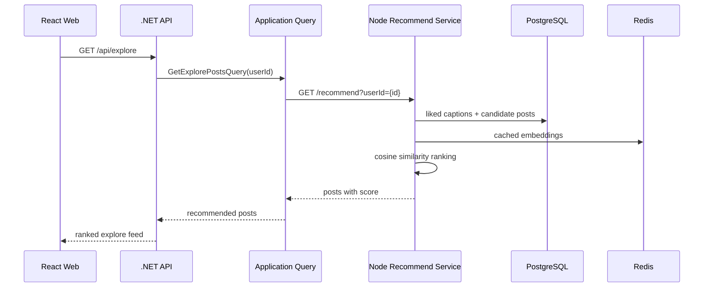
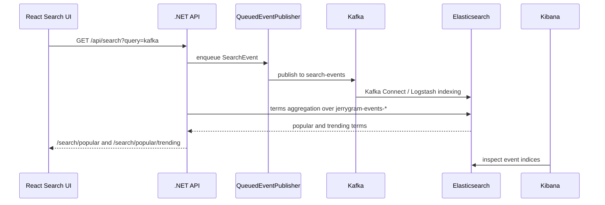

# 推薦と Kafka の証跡

Language: [English](recommendation-and-kafka.md) | [한국어](recommendation-and-kafka.ko.md) | 日本語

この文書は Jerrygram の推薦サービスと Kafka based event flow を説明し、local Docker stack から取得した証跡をまとめます。

## 推薦フロー

推薦サービスが利用できない、または結果が空の場合、.NET API はユーザーがまだフォローしていない人気投稿に fallback します。そのため、推薦サービスの状態にかかわらず UI は利用できます。

## Kafka 検索トレンドフロー

検索語は UI に hard-code されていません。検索 request が `SearchEvent` を発行し、Elasticsearch に event が保存され、`PopularSearchService` が `jerrygram-events-*` から popular/trending terms を計算します。

## Local Docker Evidence

2026-05-10 の local stack 基準:

| Surface | Evidence |
| --- | --- |
| Kafka UI | `search-events`, `post-events`, `user-events` topics が存在し、messages があります。 |
| Kibana | Elasticsearch に `jerrygram-events-search-*`, `jerrygram-events-post-*`, `jerrygram-events-user-*` indices があります。 |
| Recommendation service | `GET http://localhost:13001/health` が `status: healthy` を返します。 |

## Demo Flow

1. `http://localhost:13000` で app を開きます。
2. seed user で login します。
3. `kafka` を複数回検索します。
4. Kafka UI で `search-events` topic を確認します。
5. Kibana で `jerrygram-events-search-*` index を確認します。
6. Search page で繰り返した検索語が trend に反映されることを確認します。
