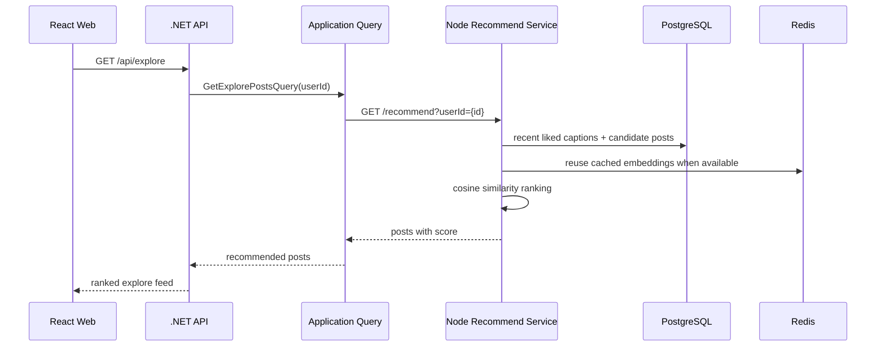
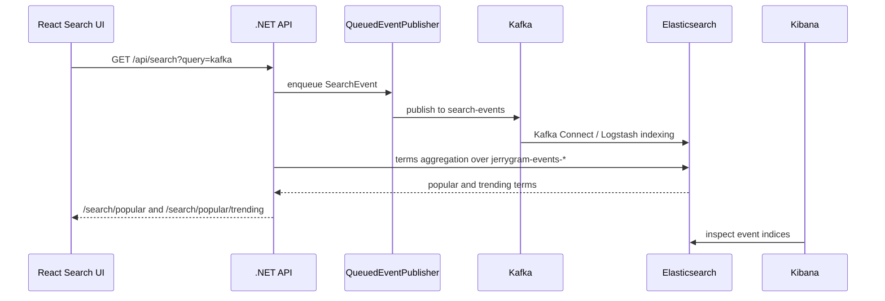

# レコメンドと Kafka の証跡

Language: [English](recommendation-and-kafka.md) | [한국어](recommendation-and-kafka.ko.md) | 日本語

この文書は、Jerrygram がレコメンドサービスと Kafka ベースのイベントストリームをどのように使うかを説明し、ローカル Docker スタックから取得した証跡を記録します。

## レコメンドフロー



レコメンドサービスが利用できない、または結果が空の場合、.NET API はユーザーがまだフォローしていない人気投稿に fallback します。これによりレコメンド品質を確認しつつ、UI は継続して利用できます。

## Kafka 検索トレンドフロー



重要なのは、検索語が UI に hard-code されていないことです。検索 request は `SearchEvent` を発行し、Elasticsearch が event index に保存し、`PopularSearchService` が `jerrygram-events-*` から人気/トレンド検索語を計算します。

## 検索イベント例

```json
{
  "eventId": "9b884560-2b1f-4d10-a78b-1c4dc7d40e91",
  "timestamp": "2026-05-10T00:00:00Z",
  "userId": "user-jerry",
  "searchTerm": "kafka",
  "searchType": "general",
  "resultCount": 13,
  "searchDuration": 42,
  "metadata": {
    "source": "web"
  }
}
```

## ローカル Docker 証跡

2026-05-10 にローカル Docker スタックで確認した内容です。

| 画面 / 表面 | 証跡 |
| --- | --- |
| Kafka UI | `jerrygram-local` cluster は online で、topic は `8` 個あります。`search-events`, `post-events`, `user-events` は non-zero offset を持っています。 |
| Kafka topics | `search-events` offset range `10`-`26`, `post-events` `1`-`20`, `user-events` `0`-`59`. |
| Kibana / Elasticsearch | `jerrygram-events-search-*`, `jerrygram-events-post-*`, `jerrygram-events-user-*` event index が存在します。 |
| Elasticsearch 件数 | 2026-05-10 index では search `8`, post `5`, user `12` documents. |
| レコメンドサービス | `GET http://localhost:13001/health` は `status: healthy`, service `jerrygram-recommend`, version `1.0.0` を返します。 |


## デモ手順

1. `http://localhost:13000` でアプリを開きます。
2. seed ユーザーでログインします。
3. `kafka` を複数回検索します。
4. Kafka UI `http://localhost:18081/ui/clusters/jerrygram-local/all-topics` で `search-events` を確認します。
5. Kibana `http://localhost:15601/app/management/data/index_management/indices` で `jerrygram-events-search-*` を確認します。
6. 検索画面を再度開き、繰り返し検索語がトレンド一覧に反映されていることを確認します。
