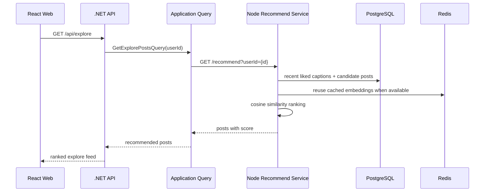
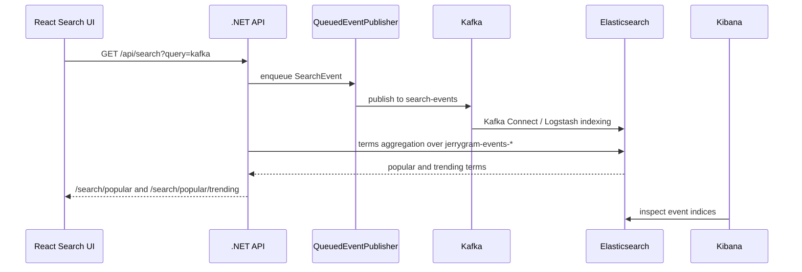

# 추천과 Kafka 증거

언어: [English](recommendation-and-kafka.md) | 한국어 | [日本語](recommendation-and-kafka.ja.md)

이 문서는 Jerrygram이 추천 서비스와 Kafka 기반 이벤트 스트림을 어떻게 사용하는지 설명하고, 로컬 Docker 스택에서 캡처한 증거를 함께 기록합니다.

## 추천 흐름



추천 서비스가 꺼져 있거나 결과가 없으면 .NET API는 사용자가 아직 팔로우하지 않는 인기 게시물로 fallback합니다. 그래서 추천 서비스의 품질은 확인할 수 있으면서도 UI는 계속 사용할 수 있습니다.

## Kafka 검색 트렌드 흐름



핵심은 검색어가 UI에 하드코딩되어 있지 않다는 점입니다. 검색 요청은 `SearchEvent`를 발행하고, Elasticsearch는 이벤트를 인덱스에 저장하며, `PopularSearchService`는 `jerrygram-events-*`에서 인기/트렌딩 검색어를 계산합니다.

## 예시 검색 이벤트

```json
{
  "eventId": "9b884560-2b1f-4d10-a78b-1c4dc7d40e91",
  "timestamp": "2026-05-10T00:00:00Z",
  "userId": "user-jerry",
  "searchTerm": "kafka",
  "searchType": "general",
  "resultCount": 13,
  "searchDuration": 42,
  "metadata": {
    "source": "web"
  }
}
```

## 로컬 Docker 증거

2026-05-10 로컬 Docker 스택에서 확인한 내용입니다.

| 화면 / 표면 | 증거 |
| --- | --- |
| Kafka UI | `jerrygram-local` cluster가 online이며 topic `8`개가 있습니다. `search-events`, `post-events`, `user-events`에 non-zero offset이 있습니다. |
| Kafka topics | `search-events` offset range `10`-`26`, `post-events` `1`-`20`, `user-events` `0`-`59`. |
| Kibana / Elasticsearch | `jerrygram-events-search-*`, `jerrygram-events-post-*`, `jerrygram-events-user-*` 이벤트 인덱스가 존재합니다. |
| Elasticsearch 문서 수 | 2026-05-10 인덱스 기준 search `8`, post `5`, user `12` documents. |
| 추천 서비스 | `GET http://localhost:13001/health`가 `status: healthy`, service `jerrygram-recommend`, version `1.0.0`을 반환합니다. |


## 데모 순서

1. `http://localhost:13000`에서 앱을 엽니다.
2. seed 사용자로 로그인합니다.
3. `kafka`를 여러 번 검색합니다.
4. Kafka UI `http://localhost:18081/ui/clusters/jerrygram-local/all-topics`에서 `search-events`를 확인합니다.
5. Kibana `http://localhost:15601/app/management/data/index_management/indices`에서 `jerrygram-events-search-*`를 확인합니다.
6. 검색 화면을 다시 열어 반복 검색어가 트렌드 목록에 반영되는지 확인합니다.
