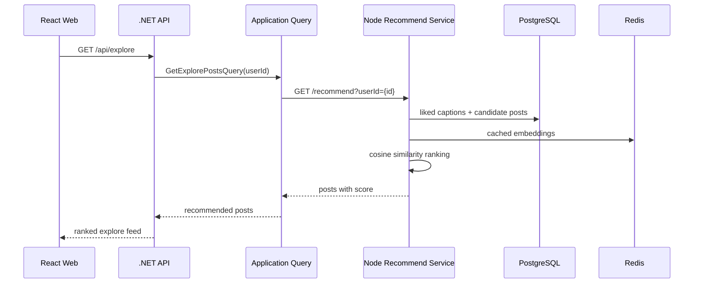
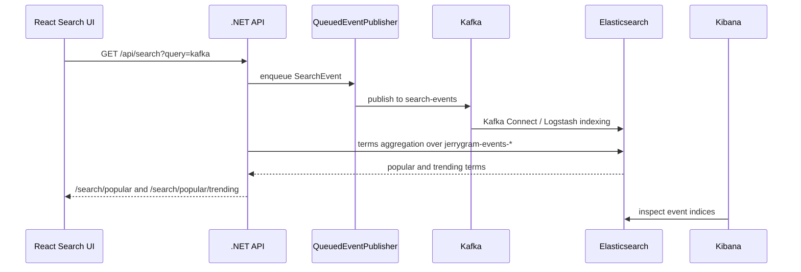
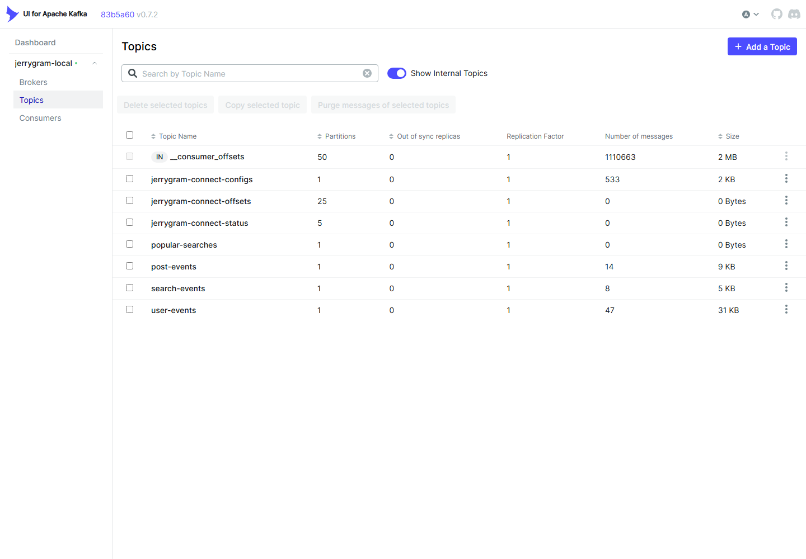
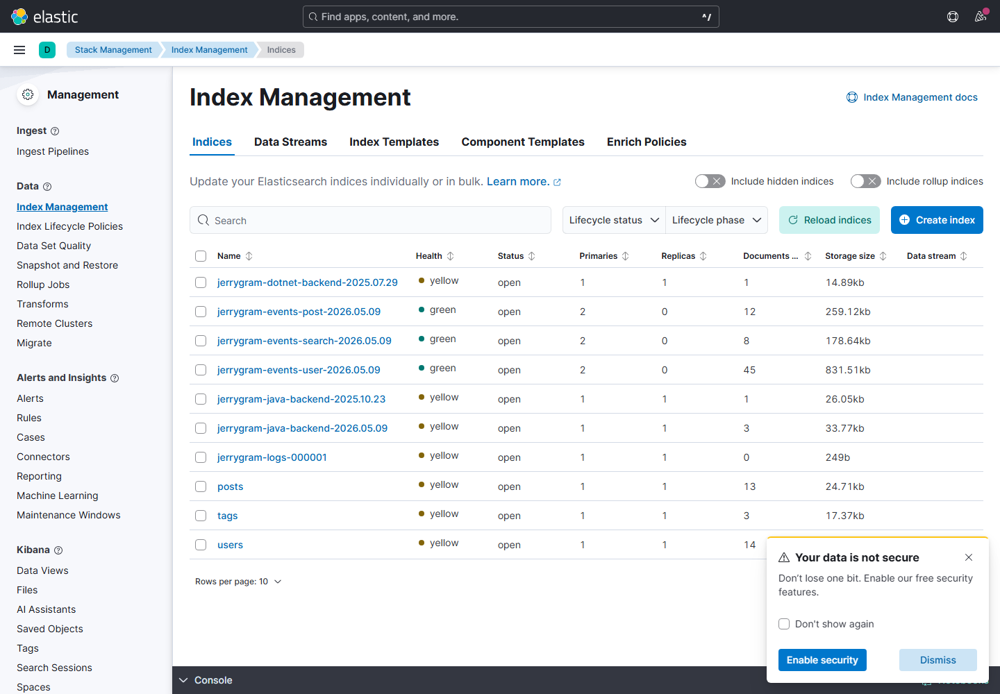

# 추천과 Kafka 증거

언어: [English](recommendation-and-kafka.md) | 한국어 | [日本語](recommendation-and-kafka.ja.md)

이 문서는 Jerrygram의 추천 서비스와 Kafka 기반 이벤트 흐름이 어떻게 동작하는지 설명하고, 로컬 Docker 스택에서 캡처한 증거를 함께 기록합니다.

## 추천 흐름

추천 서비스가 꺼져 있거나 결과가 없으면 .NET API는 사용자가 팔로우하지 않은 인기 게시물로 fallback합니다. 그래서 추천 서비스 상태와 관계없이 UI는 계속 사용할 수 있습니다.

## Kafka 검색 트렌드 흐름

검색어는 UI에 하드코딩되어 있지 않습니다. 검색 요청이 `SearchEvent`를 발행하고, Elasticsearch에 이벤트가 저장되며, `PopularSearchService`가 `jerrygram-events-*`에서 인기/트렌딩 검색어를 계산합니다.

## 로컬 Docker 증거

2026-05-10 로컬 스택 기준:

| 화면 | 증거 |
| --- | --- |
| Kafka UI | `search-events`, `post-events`, `user-events` topic이 존재하고 message가 있습니다. |
| Kibana | Elasticsearch에 `jerrygram-events-search-*`, `jerrygram-events-post-*`, `jerrygram-events-user-*` 인덱스가 있습니다. |
| 추천 서비스 | `GET http://localhost:13001/health`가 `status: healthy`를 반환합니다. |

## 데모 순서

1. `http://localhost:13000`에서 앱을 엽니다.
2. seed 사용자로 로그인합니다.
3. `kafka`를 여러 번 검색합니다.
4. Kafka UI에서 `search-events` topic을 확인합니다.
5. Kibana에서 `jerrygram-events-search-*` 인덱스를 확인합니다.
6. 검색 화면에서 반복 검색어가 트렌드에 반영되는지 확인합니다.
