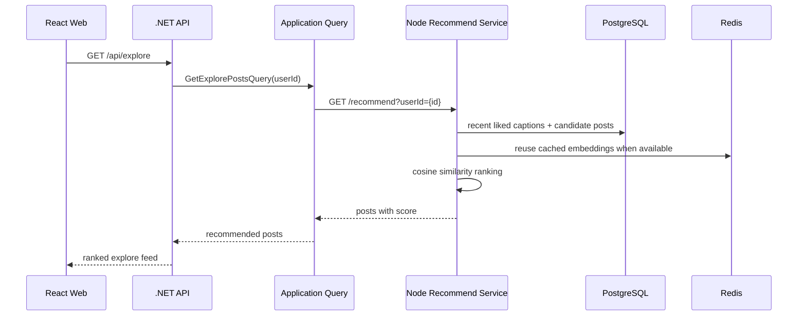
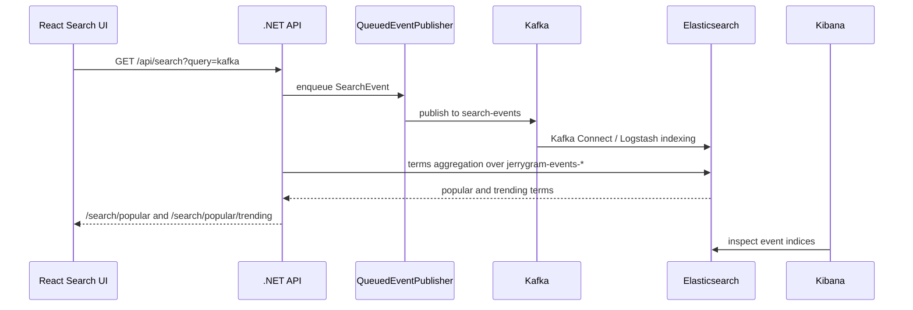

# Recommendation and Kafka Evidence

Language: English | [한국어](recommendation-and-kafka.ko.md) | [日本語](recommendation-and-kafka.ja.md)

This document explains how Jerrygram uses the recommendation service and Kafka-backed event stream, with local evidence captured from the Docker stack.

## Recommendation Flow



If the recommendation service is unavailable or returns no result, the .NET API falls back to popular posts that the user does not already follow. That keeps the UI usable while still making recommendation quality visible when the service is healthy.

## Kafka Search Trend Flow



The important bit: search terms are not hard-coded in the UI. Search requests publish `SearchEvent` records, Elasticsearch stores them by event index, and `PopularSearchService` calculates popular/trending terms from `jerrygram-events-*`.

## Example Search Event

```json
{
  "eventId": "9b884560-2b1f-4d10-a78b-1c4dc7d40e91",
  "timestamp": "2026-05-10T00:00:00Z",
  "userId": "user-jerry",
  "searchTerm": "kafka",
  "searchType": "general",
  "resultCount": 13,
  "searchDuration": 42,
  "metadata": {
    "source": "web"
  }
}
```

## Local Docker Evidence

Captured from the local Docker stack on 2026-05-10:

| Surface | Evidence |
| --- | --- |
| Kafka UI | Cluster `jerrygram-local` is online with `8` topics. `search-events`, `post-events`, and `user-events` have non-zero offsets. |
| Kafka topics | `search-events` offset range `10`-`26`, `post-events` `1`-`20`, `user-events` `0`-`59`. |
| Kibana / Elasticsearch | Event indices exist for `jerrygram-events-search-*`, `jerrygram-events-post-*`, and `jerrygram-events-user-*`. |
| Elasticsearch counts | 2026-05-10 indices include search `8`, post `5`, user `12` documents. |
| Recommend service | `GET http://localhost:13001/health` returns `status: healthy`, service `jerrygram-recommend`, version `1.0.0`. |


## Demo Script

1. Open the app at `http://localhost:13000`.
2. Sign in with a seeded user.
3. Search for `kafka` multiple times.
4. Open Kafka UI at `http://localhost:18081/ui/clusters/jerrygram-local/all-topics` and inspect `search-events`.
5. Open Kibana at `http://localhost:15601/app/management/data/index_management/indices` and inspect `jerrygram-events-search-*`.
6. Open the Search page again and confirm the trend list includes the repeated term.
