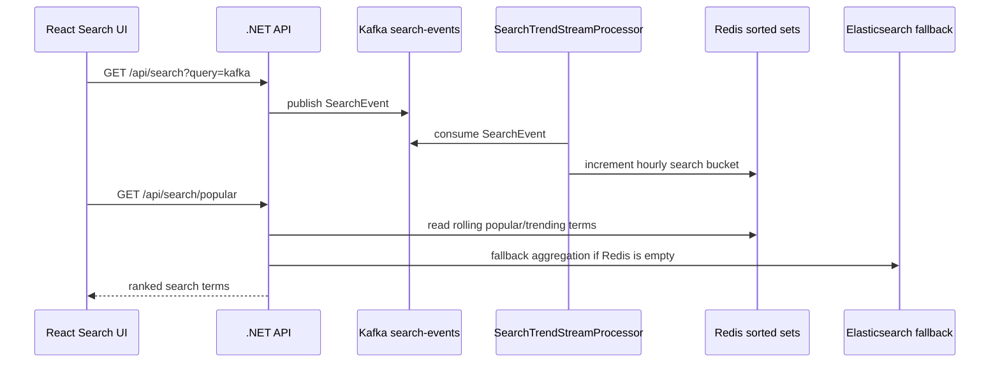

# Kafka Stream Processing

Language: [English](stream-processing.md) | [한국어](stream-processing.ko.md) | 日本語

Jerrygram には .NET backend 内の軽量 stream processor が追加されています。この processor は Kafka `search-events` を background で consume し、Redis read model にほぼリアルタイムの人気/トレンド検索語を蓄積します。

## フロー



## 目的

従来の Kafka 経路は event を Elasticsearch に保存し、人気検索語を Elasticsearch aggregation で計算していました。これは有用ですが、query-time の batch-style calculation に近いものです。Stream processor は real-time read model を追加します。

- Kafka が event source になります。
- Processor が専用 consumer group で `search-events` を consume します。
- Redis sorted set が時間単位の search bucket を保存します。
- `PopularSearchService` は Redis を先に読みます。
- Redis read model が空の場合は Elasticsearch aggregation に fallback します。

## Redis モデル

consume した検索 event は、1 つの sorted set bucket を increment します。

```text
jg:search-trends:yyyyMMddHHmm
```

member は正規化された検索語で、score は検索回数です。Bucket は設定された retention window の後に expire します。

## 設定

```json
"SearchTrendStreamProcessor": {
  "Enabled": true,
  "BootstrapServers": "localhost:19092",
  "Topic": "search-events",
  "ConsumerGroup": "jerrygram-search-trend-processor",
  "ClientId": "jerrygram-search-trend-processor",
  "AutoOffsetReset": "Earliest",
  "PollTimeoutMs": 1000,
  "RetentionHours": 168,
  "BucketMinutes": 60
}
```

## 運用メモ

- Processor は Redis 更新後に Kafka offset を commit します。
- 不正な message は skip して commit するため、consumer group が 1 件の event で停止しません。
- Redis が利用できない場合は warning を出し、request path を壊さず後で再試行します。
- Processor がなくても Elasticsearch aggregation fallback により API は継続して動作します。
