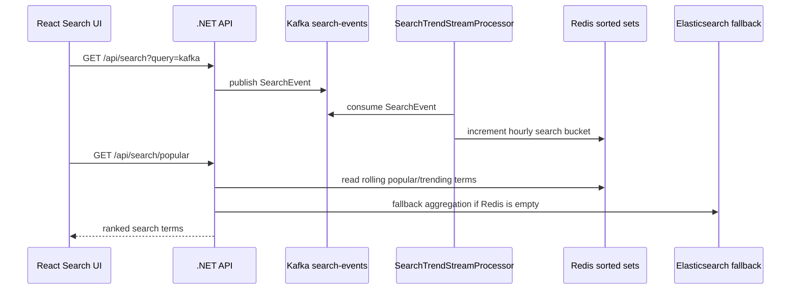

# Kafka Stream Processing

언어: [English](stream-processing.md) | 한국어 | [日本語](stream-processing.ja.md)

Jerrygram에는 .NET 백엔드 내부의 가벼운 stream processor가 추가되어 있습니다. 이 processor는 Kafka `search-events`를 백그라운드에서 consume하고, Redis read model에 실시간에 가까운 인기/트렌딩 검색어를 누적합니다.

## 흐름



## 왜 추가했는가

기존 Kafka 경로는 이벤트를 Elasticsearch에 저장하고, 인기 검색어를 Elasticsearch aggregation으로 계산했습니다. 이 방식도 유용하지만 조회 시점에 집계하는 batch-style 계산에 가깝습니다. Stream processor는 실시간 read model을 추가합니다.

- Kafka가 이벤트 소스 역할을 합니다.
- Processor가 별도 consumer group으로 `search-events`를 consume합니다.
- Redis sorted set이 시간 단위 검색어 bucket을 저장합니다.
- `PopularSearchService`는 Redis를 먼저 읽습니다.
- Redis read model이 비어 있으면 Elasticsearch aggregation으로 fallback합니다.

## Redis 모델

consume한 검색 이벤트는 하나의 sorted set bucket을 증가시킵니다.

```text
jg:search-trends:yyyyMMddHHmm
```

member는 정규화된 검색어이고 score는 검색 횟수입니다. Bucket은 설정된 retention window 이후 만료됩니다.

## 설정

```json
"SearchTrendStreamProcessor": {
  "Enabled": true,
  "BootstrapServers": "localhost:19092",
  "Topic": "search-events",
  "ConsumerGroup": "jerrygram-search-trend-processor",
  "ClientId": "jerrygram-search-trend-processor",
  "AutoOffsetReset": "Earliest",
  "PollTimeoutMs": 1000,
  "RetentionHours": 168,
  "BucketMinutes": 60
}
```

## 운영 참고

- Processor는 Redis 갱신 후 Kafka offset을 commit합니다.
- 잘못된 메시지는 skip 후 commit해서 consumer group이 한 이벤트에 막히지 않게 합니다.
- Redis를 사용할 수 없으면 warning을 남기고 나중에 재시도하며, request path는 깨지지 않습니다.
- Processor가 없어도 Elasticsearch aggregation fallback 덕분에 API는 계속 동작합니다.
