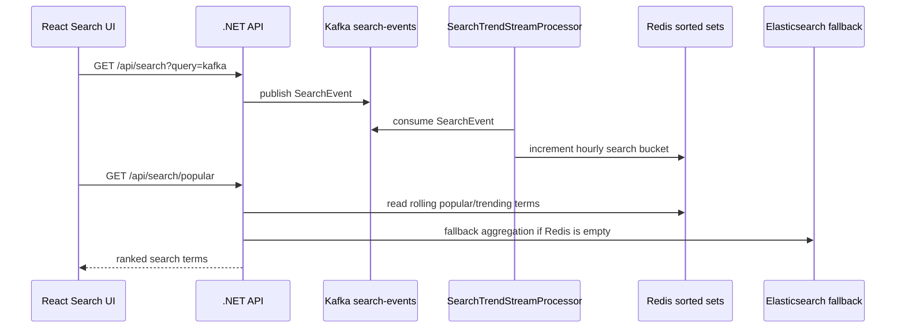

# Kafka Stream Processing

Language: English | [한국어](stream-processing.ko.md) | [日本語](stream-processing.ja.md)

Jerrygram now includes a lightweight stream processor inside the .NET backend. It consumes Kafka `search-events` in the background and maintains a Redis read model for near-real-time popular and trending search terms.

## Flow



## Why This Exists

The original Kafka path persisted events into Elasticsearch and calculated popular search terms with Elasticsearch aggregations. That is useful, but it is still a query-time batch-style calculation. The stream processor adds a real-time read model:

- Kafka remains the event source.
- The processor consumes `search-events` with its own consumer group.
- Redis sorted sets store hourly search buckets.
- `PopularSearchService` reads Redis first.
- Elasticsearch aggregation remains the fallback when the Redis read model is empty.

## Redis Model

Each consumed search event increments one sorted set bucket:

```text
jg:search-trends:yyyyMMddHHmm
```

The member is the normalized search term and the score is the count. Buckets expire after the configured retention window.

## Configuration

```json
"SearchTrendStreamProcessor": {
  "Enabled": true,
  "BootstrapServers": "localhost:19092",
  "Topic": "search-events",
  "ConsumerGroup": "jerrygram-search-trend-processor",
  "ClientId": "jerrygram-search-trend-processor",
  "AutoOffsetReset": "Earliest",
  "PollTimeoutMs": 1000,
  "RetentionHours": 168,
  "BucketMinutes": 60
}
```

## Operational Notes

- The processor commits Kafka offsets after Redis is updated.
- Malformed messages are skipped and committed so one bad event does not block the consumer group.
- If Redis is unavailable, processing logs a warning and retries later without breaking the request path.
- The API still works without the processor because Elasticsearch aggregation remains available.
